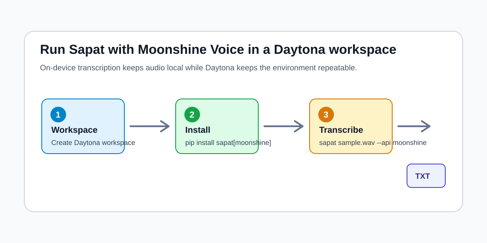

# Run Local Moonshine Transcription with Sapat

AI transcription projects usually start with a hosted API because it is quick:
add a key, upload an audio file, and wait for a transcript. That is a good
default for many products, but it is not the only path. Some teams need a
workflow where recordings stay local, model calls do not depend on a metered
API, and the same setup can be reproduced by every engineer on the project.

This guide shows how to run
[Sapat](https://github.com/nkkko/sapat) with a local
[Moonshine Voice](https://github.com/moonshine-ai/moonshine) provider inside a
[Daytona workspace](https://www.daytona.io/). Moonshine Voice is an on-device
speech stack built for live transcription and voice interfaces. In this
workflow, Sapat handles the command-line file processing while Moonshine
performs [on-device speech-to-text](../definitions/20260527_definition_on_device_speech_to_text.md)
without requiring an OpenAI, Groq, or Azure key.

The companion implementation for this guide is open in
[nibzard/sapat#54](https://github.com/nibzard/sapat/pull/54). It adds
`--api moonshine`, converts input media to a temporary 16 kHz mono WAV file,
and calls the official `moonshine-voice` Python package.



## TL;DR

- Create a Daytona workspace from the Sapat repository or the companion branch.
- Install Sapat with the optional `moonshine` extra.
- Run `sapat sample.wav --api moonshine --language en`.
- Keep audio local, but expect a first-run model download and local CPU usage.

## Prerequisites

You need the following before starting:

- A working Daytona installation.
- Python 3.8 or newer in the workspace.
- `ffmpeg`, because Sapat uses it to convert media files.
- A short `.wav` or `.mp4` recording for testing.
- Git access to the companion Sapat branch while the PR is under review.

Moonshine Voice does not need an API key for local transcription. The package
downloads and caches the selected model the first time it runs. That download
is normal, but do not commit model files or generated transcripts to your repo.

## Create the Daytona Workspace

Start by creating a workspace from the Sapat fork that contains the Moonshine
provider branch:

```bash
daytona create https://github.com/jonahsills/sapat --code
```

Once the workspace opens, switch to the implementation branch:

```bash
git fetch origin bounty/moonshine-provider
git switch bounty/moonshine-provider
```

If the companion PR has already merged by the time you read this, use the
upstream Sapat repository and its `main` branch instead:

```bash
daytona create https://github.com/nkkko/sapat --code
```

Daytona gives the project a repeatable development environment. That matters
for local transcription because the result depends on Python packages, system
audio tooling, and compatible native wheels. When the workspace is reproducible,
the same setup can be used by another engineer without a long "works on my
machine" debugging session.

## Install Sapat with Moonshine Support

Create and activate a virtual environment inside the workspace:

```bash
python -m venv .venv
. .venv/bin/activate
python -m pip install --upgrade pip
```

Install the project with the optional Moonshine dependency:

```bash
python -m pip install '.[moonshine]'
```

The optional extra keeps Sapat's cloud-provider path lightweight. Engineers who
only use OpenAI, Groq, or Azure do not need Moonshine's native runtime. People
who choose `--api moonshine` install the local model package explicitly.

Confirm that the command is available:

```bash
sapat --help
```

The API choices should include `moonshine`:

```text
--api [openai|groq|azure|moonshine]
```

If `sapat` is not found, keep the virtual environment active or run it as a
module from the project checkout:

```bash
PYTHONPATH=src python -m sapat.script --help
```

## Why Put Local ASR in a Workspace?

Local transcription is often presented as a desktop-only workflow: install a
model on a laptop, point it at a file, and hope another developer can recreate
the same result later. That is fine for a quick experiment, but it gets messy
when the project becomes shared. Native wheels, model caches, `ffmpeg`, Python
versions, and shell paths can all differ between machines.

A Daytona workspace narrows those differences. The project can document one
install path, one branch, and one set of validation commands. A teammate can
open the same repository and focus on transcript quality instead of debugging
system setup. That is especially helpful for AI engineers who are comparing
providers. You can run the hosted Sapat providers when API keys are available,
then switch to Moonshine when the test requires local audio handling.

This also gives you a cleaner security boundary. Raw recordings can stay in the
workspace, generated transcripts can be reviewed before sharing, and secrets
for hosted APIs are not required for the Moonshine path. Local transcription is
not automatically private if you copy files elsewhere, but it removes the
network upload that hosted speech APIs normally require.

## Prepare a Test Recording

Use a short file first. A ten to thirty second clip is enough to verify the
pipeline, model download, conversion, and transcript writing.

If you already have a file, copy it into the project directory:

```bash
cp /path/to/short-recording.wav sample.wav
```

You can also test with an `.mp4` file:

```bash
cp /path/to/demo-recording.mp4 demo.mp4
```

For non-WAV inputs, Sapat creates a temporary WAV file for Moonshine, runs
transcription, writes a `.txt` file next to the input, and removes the
temporary WAV file afterward. Existing WAV files are used directly.

## Run Local Transcription

Run Sapat with the Moonshine provider:

```bash
sapat sample.wav --api moonshine --language en
```

For a video file, use the same API flag:

```bash
sapat demo.mp4 --api moonshine --language en
```

The first run may take longer because `moonshine-voice` downloads the language
model and stores it in its local cache. Later runs should start faster because
the cached model can be reused.

When the command finishes, Sapat writes a transcript beside the input file:

```bash
ls sample.txt
sed -n '1,80p' sample.txt
```

Moonshine is designed for local and live speech use cases. That makes it a good
fit for quick private notes, voice-command prototypes, and early experiments
where you do not want to upload raw audio. It is not a drop-in replacement for
every hosted API. Benchmark it with your own accents, microphones, noise
levels, and file lengths before using it in production.

## Understand the Provider Limits

The Moonshine provider is intentionally small. It focuses on local
transcription and avoids pretending to support cloud-only features.

Sapat's `--prompt` and `--temperature` flags are useful for hosted APIs that
accept those parameters. Moonshine Voice does not use them in this workflow, so
passing them will not change the local model output.

Sapat's `--correct` option depends on a chat model from a cloud provider. The
Moonshine provider rejects `--correct` with a clear error because local
transcription should not silently call a hosted LLM. If you want post-processing
after a local transcript, run that as a separate step and decide explicitly
where the text is allowed to go.

The current Sapat directory mode processes `.mp4` files. For batch jobs with
other media types, convert or organize inputs before invoking Sapat, or extend
the directory scanner in a separate change.

## Validate the Setup

Use these checks after installation:

```bash
sapat --help
python -m pip check
```

Then run one short transcription:

```bash
sapat sample.wav --api moonshine --language en
test -s sample.txt
```

For implementation work on the provider, run the mocked tests from the Sapat
checkout:

```bash
PYTHONPATH=src python -m unittest discover -s tests -v
python -m py_compile \
  src/sapat/script.py \
  src/sapat/transcription/base.py \
  src/sapat/transcription/moonshine.py \
  tests/test_moonshine.py
git diff --check
```

The tests fake the `moonshine_voice` module. They verify CLI routing,
temporary WAV cleanup, dependency errors, and transcript extraction without
downloading a model.

## Make the Workflow Team-Friendly

Once a single-file test works, write down the exact decisions your team made.
That can live in your project README or in a `docs/transcription.md` file.
Include the workspace source repository, the expected Python version, the media
formats you accept, where transcripts are written, and whether transcripts are
allowed to leave the workspace.

For repeatable jobs, keep input and output folders separate:

```text
recordings/
  raw/
  reviewed/
transcripts/
  draft/
  approved/
```

Run Sapat on files from `recordings/raw`, review the generated `.txt` files,
and only move cleaned transcripts into `transcripts/approved`. That small
folder convention prevents generated text from being mistaken for reviewed
content. It also makes it easier to add a later quality-assurance step, such as
checking for empty transcripts or comparing word counts between providers.

If you later add a hosted correction or summarization step, keep it separate
from the Moonshine command. A local transcription command should not quietly
send text to another service. Explicit steps make audits, privacy reviews, and
debugging much easier.

## When to Choose Another Provider

Moonshine is a strong fit when the recording is short, speech is live or close
to live, and keeping audio local is a key requirement. A hosted provider may be
better when you need large-file handling, built-in diarization, domain-specific
vocabulary controls, or managed scaling for many hours of audio. Treat Sapat's
provider flag as a way to choose the right backend for each job rather than as
a single permanent decision.

## Troubleshooting

**Problem:** `ImportError` mentions `moonshine-voice`.

**Solution:** Install the optional extra inside the active virtual environment:

```bash
python -m pip install '.[moonshine]'
```

**Problem:** `ffmpeg` is not found.

**Solution:** Install `ffmpeg` in the workspace image or on the host that backs
the workspace. Sapat needs it before Moonshine receives audio.

**Problem:** The first run is slow.

**Solution:** Let Moonshine finish downloading and caching the model. The next
run with the same language should reuse the cached assets.

**Problem:** The transcript is empty or poor quality.

**Solution:** Try a clearer recording, verify that the input has audible
speech, and test a short WAV before moving to longer video files. Local ASR
quality depends heavily on microphone quality, background noise, and language
support.

## Conclusion

With Daytona, Sapat, and Moonshine Voice, you can build a transcription workflow
that is easy to recreate and does not require a hosted speech API key. Daytona
keeps the environment consistent, Sapat provides the command-line pipeline, and
Moonshine keeps recognition local to the workspace.

That combination is useful when privacy and reproducibility are the core
requirements. Start with short recordings, verify the output, then decide
whether local transcription should become the default path or one provider
option alongside OpenAI, Groq, and Azure.

## References

- [Sapat repository](https://github.com/nkkko/sapat)
- [Moonshine Voice repository](https://github.com/moonshine-ai/moonshine)
- [Moonshine Voice PyPI package](https://pypi.org/project/moonshine-voice/)
- [Companion Sapat PR](https://github.com/nibzard/sapat/pull/54)
